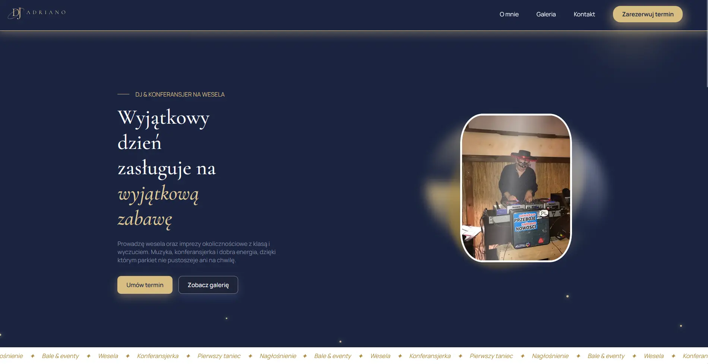

# DJ Adriano — Wedding DJ & Host

A one-page promotional website for **Adriano**, a wedding DJ and host
for weddings and special events. Built as a fast, fully
static site — no frameworks, no build step, just clean HTML and CSS.

🌐 **Live site:** [adrianodj.pl](https://adrianodj.pl)

## Preview


## Features
- **Single-page layout** with smooth in-page navigation (About, Gallery, Contact)
- **Responsive design** — adapts from desktop down to mobile, with a hamburger menu on small screens
- **Accessibility-minded** — semantic HTML, ARIA labels, and alt text on media
- **Promo video** and image gallery showcasing events
- **Contact section** with direct email, phone, and a reservation call-to-action
- **PWA basics** — favicons and a web manifest for a polished look on all devices

## Tech stack
- **HTML5** — semantic, hand-written markup
- **CSS3** — custom styles with CSS variables (no framework)
- **Google Fonts** — Cormorant Garamond & Manrope
- Deployed on **Vercel** with domain from OVH

## Project structure
```
DJ-site/
├── index.html          # The page markup
├── dj-site.css         # All styles
├── site.webmanifest    # PWA manifest
├── assets/             # Logo, photos, promo video
└── icons/              # UI icons and favicons
```

## Running locally
No build tools or dependencies are required. Either:

1. **Get the files** - clone the repo (or download it as a ZIP):
    ```bash
   git clone https://github.com/majkab8/DJ-site.git
   cd DJ-site
   ```
    
2. **Open the site** - either:
  - **Directly:** double-click `index.html` to open it in your browser, or
  - **Serve locally** (recommended, so paths behave like production):

   ```bash
   # Python 3
   python -m http.server 8000
   ```

   Then visit `http://localhost:8000`.

## Deployment
The site is deployed on [Vercel](https://vercel.com) and served from the
custom domain **adrianodj.pl**. Any push to the `main` branch triggers an
automatic redeploy.

## Contact
- **Bookings & enquiries for the DJ** - see the contact section on the
[live site](https://adrianodj.pl).
- **Questions about this website or its code** - reach out via [GitHub](https://github.com/majkab8)

## Authors
- **Maja Bednarek** - design & front-end development - [GitHub](https://github.com/majkab8)

Built for **DJ Adriano**.

## License
© 2026 DJ Adriano. All rights reserved.
This code is published for portfolio purposes only and may not be reused,
copied, or redistributed without permission.
